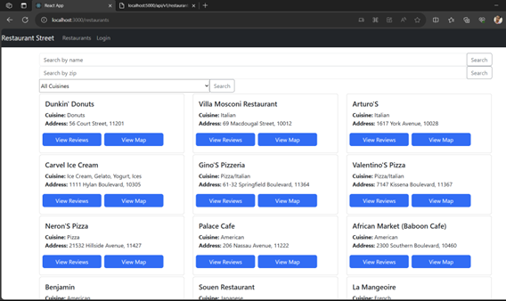
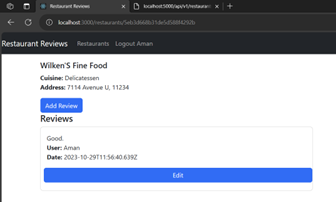

# MERN-Restaurant-Reviews
Ability to log in, log out, search for reviews based on name, zipcode, cuisines, view reviews. Once logged in, user can add a review, update a review. User can only update a review if they posted it.
# API testing for restaurant reviews (Backend)
# ------------------------------------------

 
/restaurants is the homepage which lists all the restaurants

 
/restaurants?zipcode=10012 shows a query search based on given parameter

 
/restaurants?zipcode=110085 is empty because Collection has no restaurants from that area. 

 
/restaurants tested on Postman. For some reason, Chrome didn’t display the JSON results in an appealing format.

 
/restaurants?name=food searches restaurants with the word “food” in them. An index on name is created before this query.

 
A review is added for a given restaurant ID.

 
Review added successfully

 
Checking review on MongoDB Atlas.

 
/cuisines lists all the cusines

# ------------------------------------------
# Feature testing for restaurant reviews frontend
# ------------------------------------------

 
/restaurants on the React app shows all restaurants as displayed here.

 
Searching a restaurant by name

 
Looking at earlier added review. Notice we cannot edit the review because we are not logged in.

 
Logging in the same credentials which were used to add reviews earlier. This will show that we can only edit our own reviews. After logging in, we are redirected to ‘/’ which shows all restaurants, but remember that the user state is now set in App. We are logged in
Also, to test the check on user and user ID, ensure that the username and ID you enter here is the same one you used to post your review.
Then, when we select the restaurant we should be able to edit it.

 
Same homepage but we can see it says ‘Logout aman’

 
We can see we can edit our reviews. Let’s edit it.

 

 

 

